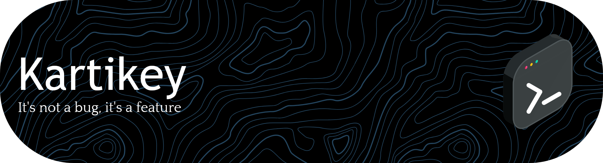

## 💫 About Me:
☕ Building more systems than excuses — currently deep into AI + backend engineering  
🚀 B.Tech CSE (Big Data) @ UPES | DataStorm’24 Winner  
🧠 Focused on multi-agent AI systems, real-world APIs, and scalable backend logic  
🔍 Exploring how AI agents + automation can solve practical problems (not just demos)  
📫 Email: kartikeybhasin.tech@gmail.comm

---

## ⚙️ What I’ve Built:
🤖 **Multi-Agent Translator System**  
→ Extracts text from images, translates, overlays back with preserved styling  
→ Includes TTS + multilingual support + full-stack pipeline  

📊 **Facebook Analytics Dashboard**  
→ Real-time insights (reach, engagement, impressions) via Graph API  
→ AI-generated suggestions using agent workflows  

💬 **AI Chatbot Portfolio Website**  
→ Chatbot that mimics my personality using CrewAI + Gemini API  
→ Fully responsive, animated frontend  

🧾 **College Feedback Sentiment System**  
→ NLP-based sentiment analysis platform with dashboards for insights  

---

## 💻 Tech Stack:

---

## 🧠 Currently Exploring:
- Multi-agent architectures (CrewAI, autonomous workflows)
- AI + real-time systems integration  
- Backend system design & scalable APIs  
- Applied NLP & LLM-based products  

## 🔗 Connect with me:

